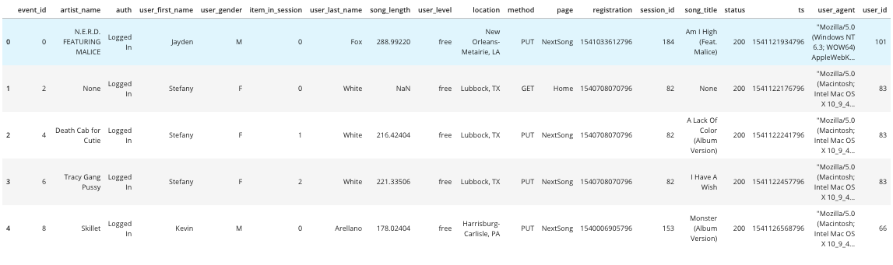
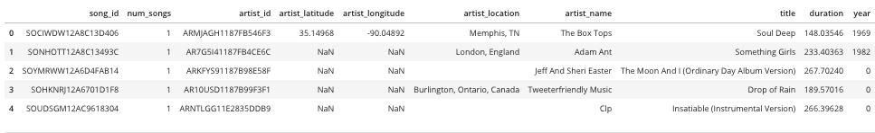
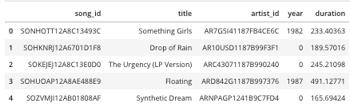
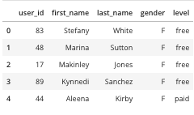
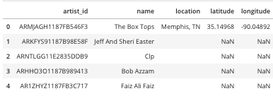
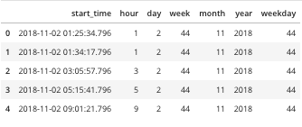

# Data Warehouse with AWS (S3 and Redshift)
## Introduction 

A startup called Sparkify collected the data on songs and user activities, they are interested to have insight on the data which is collected in json format. Dataware house using AWS components need to be created.

## Description 
Complete ETL pieple need to be created in AWS, first data need to be move to S3, then Dimension, Fact and Staging tables need to created in Redshift. After data is moved to S3, data is moved to Staging table using COPY command in redshift, then data is ingested from Staging tables to respective Fact and Dimension tables.

## Data sources
- songs data set <https://labrosa.ee.columbia.edu/millionsong/>
- logs data set: <https://github.com/Interana/eventsim>

## Project Files

- 'dwh.cfg': Config file for defining AWS attributes
- 'create_tables.py': It drops all the table, create all staging, dimension and fact tables. Run this file before running "etl.ipynb"
- 'etl.py': Read all record from staging table and ingest to fact and dimension tables.
- 'test.ipynb': execute some query to check if data is inserted in table correctly, 
- 'sql_queries.py': incluce all queries to create and drop tables, inserting data to the tables
- 'README.md': project info.

## Project Flow in AWS
- Create S3 bucket in nearest region move data from data folder
- Create Redshift cluster
    - dc2.large
    - Node: 1
    - Assign security group
    - Assign role to read S3 bucket
- Provide info in dwh.cfg file
- Run create_tables.py file from python terminal
- Run sql_queries.py this will ingest data to the tables
- Run commands in test.ipynb to test all data is ingested sucessfully

## Staging Table    

## Table view
### Fact Table
#### Songplays

### Dimension table
#### Songs

#### Users

#### Artists

#### Time

